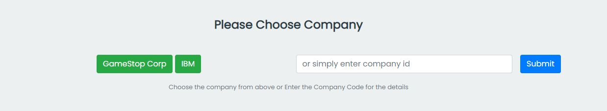

<h1>$ Stock Tracker 🚀</h1>

	It's a demo project which fetch company data from the API
	Endpoint(https://www.alphavantage.co/)

Just need to pass the company code as the URL params

		https://akashprasher.github.io/Stock-Tracker-From-API?s={CompanyCode}

Where {ComapnyCode} is equal to the company code.

For example s=ibm or s=gme

<h5>Manually entering the Company code</h5>

