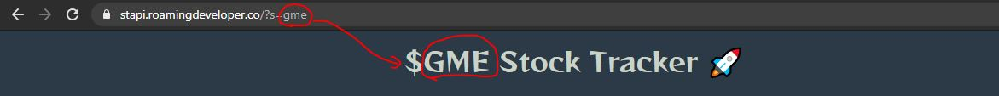

<h1>$ Stock Tracker 🚀</h1>

	It's a demo project which fetch company data from the API
	Endpoint(https://www.alphavantage.co/)

Just need to pass the company code as the URL params

		`https://stapi.roamingdeveloper.co/?s={CompanyCode}`

Where {ComapnyCode} is equal to the company code.

For example s=ibm or s=gme

<h4>Manually entering the Company code</h4>

<h4>Or Simply choose from the given name of companies</h4>

<h4>Dynamic Title as per the Company.</h4>

<h4>Dynamic Footer as per the Company.</h4>

<h4>Dynamic Chart as per the data detched from API</h4>

